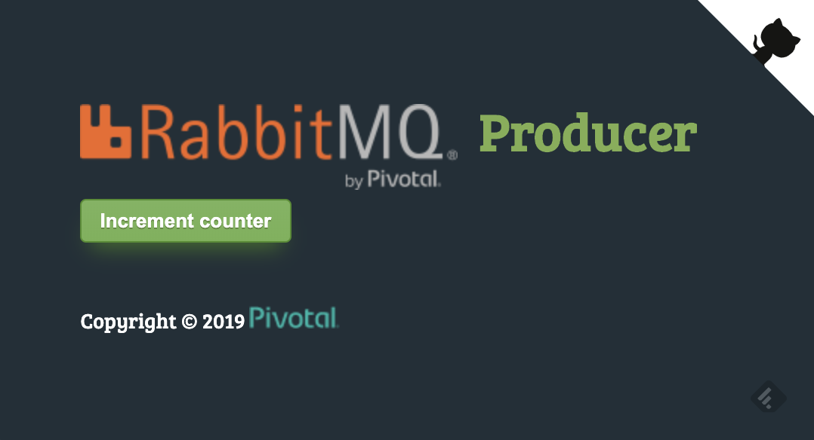
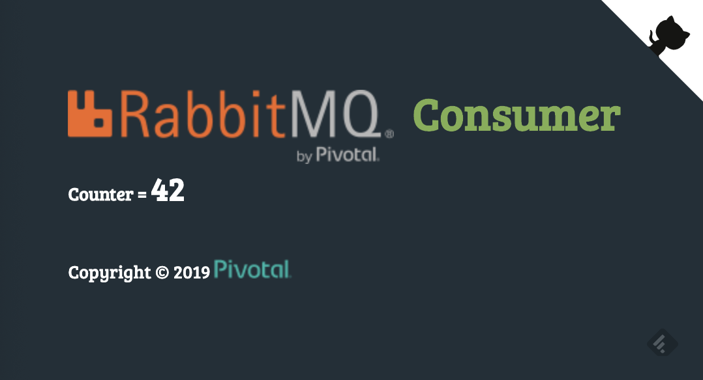

# RabbitMQ Operator for Kubernetes demo

This project shows to use the
[RabbitMQ Operator for Kubernetes](https://content.pivotal.io/blog/introducing-rabbitmq-for-kubernetes)
to manage message broker instances on your Kubernetes clusters.

Leveraging [Spring Cloud Stream](https://spring.io/projects/spring-cloud-stream),
see how easy it is to connect Spring Boot apps to a RabbitMQ broker deployed
to Kubernetes.

## How to use it?

Compile this app using a JDK 8+:
```bash
$ ./mvnw clean package
```

This app is made of two components: a producer and a consumer.
The producer sends messages to a queue, which are read by the consumer.
A counter is incremented each time a message is received.
Both apps are exchanging messages through a RabbitMQ queue.

Start a RabbitMQ instance on your host:
```bash
$ docker run --rm -p 5672:5672/tcp -p 15672:15672/tcp rabbitmq:3-management
```

Start the producer app:
```bash
$ java -jar producer/target/k8s-rmq-producer.jar
```

Start the consumer app:
```bash
$ java -jar consumer/target/k8s-rmq-consumer.jar
```

The producer app is available at http://localhost:8080:


The consumer app is available at http://localhost:8081:


## Deploying to Kubernetes

Make sure you first deploy the RabbitMQ Operator for Kubernetes.

Then, you can deploy this app:
```bash
$ kubectl apply -f k8s
namespace/k8s-rmq-operator created
deployment.apps/producer created
deployment.apps/consumer created
service/producer created
service/consumer created
rabbitmqcluster.rabbitmq.pivotal.io/rmqdemo created
```

The RabbitMQ instance is defined by this YAML file:
```yaml
---
apiVersion: rabbitmq.pivotal.io/v1beta1
kind: RabbitmqCluster
metadata:
  name: rmqdemo
  namespace: k8s-rmq-operator
spec:
  replicas: 1
  persistence:
    storage: 10Gi
```

You may create up to 3 replicas for your RabbitMQ instance.

The RabbitMQ Operator will take of generating credentials as Kubernetes secrets.

Show RabbitMQ generated username:
```bash
$ printf $(kubectl -n k8s-rmq-operator get secrets rmqdemo-rabbitmq-admin -o jsonpath="{.data.rabbitmq-username}" | base64 -D); echo
wo9stjiI0Tj75a-_BOd0mWTVP6XN9pE7
```

Show RabbitMQ generated password:
```bash
$ printf $(kubectl -n k8s-rmq-operator get secrets rmqdemo-rabbitmq-admin -o jsonpath="{.data.rabbitmq-password}" | base64 -D); echo
TtHh0WfMbZ8UFb4bM7StnmI4q6eRlPil
```

You may use these credentials to access the RabbitMQ management console:
```bash
$ kubectl -n k8s-rmq-operator port-forward service/rmqdemo-rabbitmq-ingress 15672
```

The management console is then available at http://localhost:15672.

Beware that **you should not use these credentials in your application
properties**: since these values are stored as Kubernetes secrets,
you don't need to write it down in `application.properties` for example.
You could instead load these credentials as environment variables,
only available for selected pods, by mounting the RabbitMQ secret.

This is how this sample app is using RabbitMQ generated credentials with
Spring Cloud Stream:
```yaml
env:
  - name: SPRING_RABBITMQ_USERNAME
    valueFrom:
      secretKeyRef:
        name: rmqdemo-rabbitmq-admin
        key: rabbitmq-username
  - name: SPRING_RABBITMQ_PASSWORD
    valueFrom:
      secretKeyRef:
        name: rmqdemo-rabbitmq-admin
        key: rabbitmq-password
```

As the pod is created, new environment variables are set with values
coming from the credentials which were generated by the RabbitMQ Operator.

## Contribute

Contributions are always welcome!

Feel free to open issues & send PR.

## License

Copyright &copy; 2019 [Pivotal Software, Inc](https://pivotal.io).

This project is licensed under the [Apache Software License version 2.0](https://www.apache.org/licenses/LICENSE-2.0).
